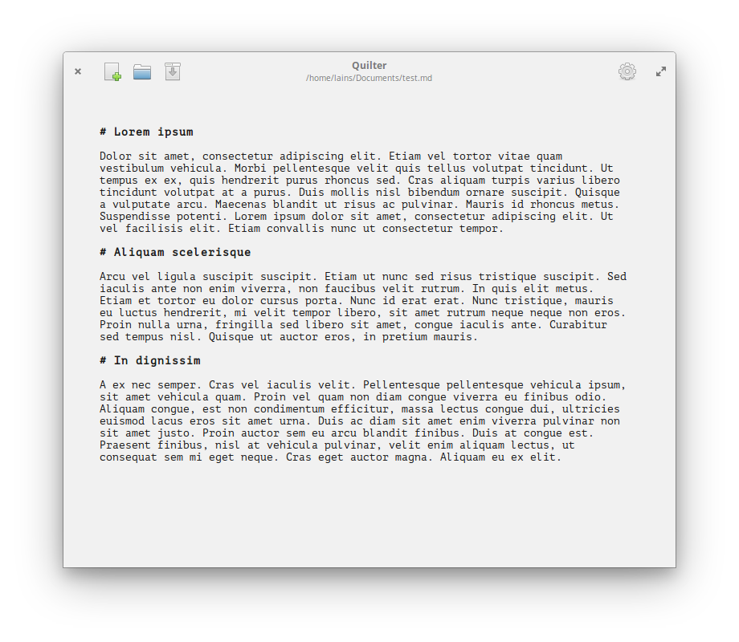

#  Quilter
## Focus on your writing.
[](https://appcenter.elementary.io/com.github.lainsce.quilter)



## License
[](http://www.gnu.org/licenses/gpl-3.0)

Fonts under the `/data/font` directory are under [License: SIL OFL 1.1](http://scripts.sil.org/OFL), also copied there in full.

## Dependencies

Please make sure you have these dependencies first before building.

```
granite
gtk+-3.0
gtksourceview-3.0
libwebkit2gtk-4.0-dev
meson
```

## Building

Simply clone this repo, then:

```
$ meson build && cd build
$ mesonconf -Dprefix=/usr
$ sudo ninja install
```
