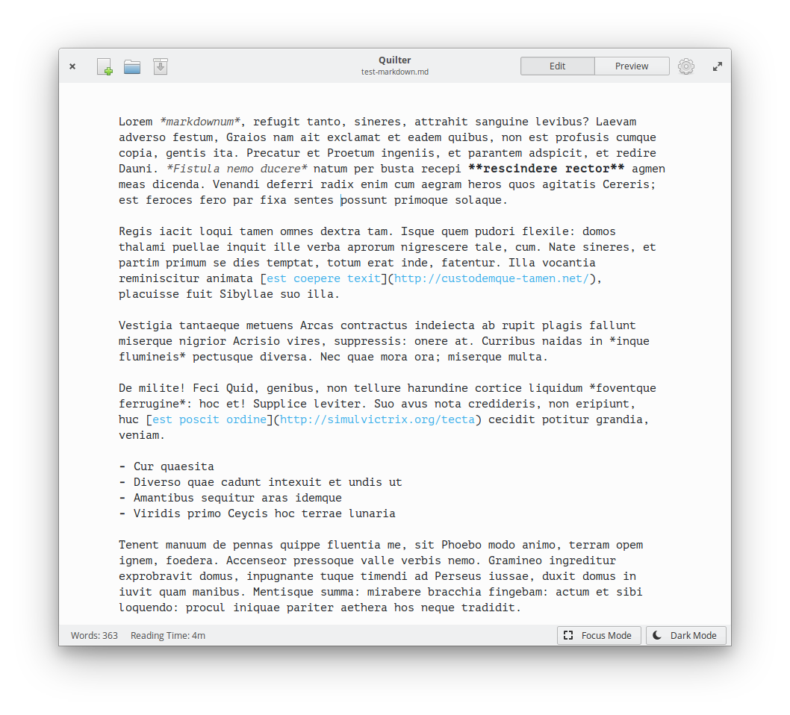

#  Quilter

## Focus on your writing

<a href='https://flathub.org/apps/details/io.github.lainsce.Quilter'></a>

[](https://stopthemingmy.app)
[](http://www.gnu.org/licenses/gpl-3.0)



## License

Fonts under the `/data/font` directory are under [License: SIL OFL 1.1](http://scripts.sil.org/OFL), also copied there in full.

## Donations

Would you like to support the development of this app to new heights? Then:

[Be my backer on Patreon](https://www.patreon.com/lainsce)

## Dependencies

Please make sure you have these dependencies first before building.

```bash
valac
gtk+-3.0
gtksourceview-4-dev
libwebkit2gtk-4.0-dev
libmarkdown2-dev
libgtkspell3-3-dev
libhandy-1-dev >= 0.80.0
meson
```

## Building

Simply clone this repo, then:

```bash
meson build --prefix=/usr && cd build
sudo ninja install
```

## Arch Linux

Arch Linux users can find Quilter under the name [quilter-git](https://aur.archlinux.org/packages/quilter-git/) in the **AUR**:

`$ <aur_helper> -S quilter-git`

## Fedora

Fedora users can find Quilter under the name [quilter](https://src.fedoraproject.org/rpms/quilter) in official repository:

`$ sudo dnf install quilter`
