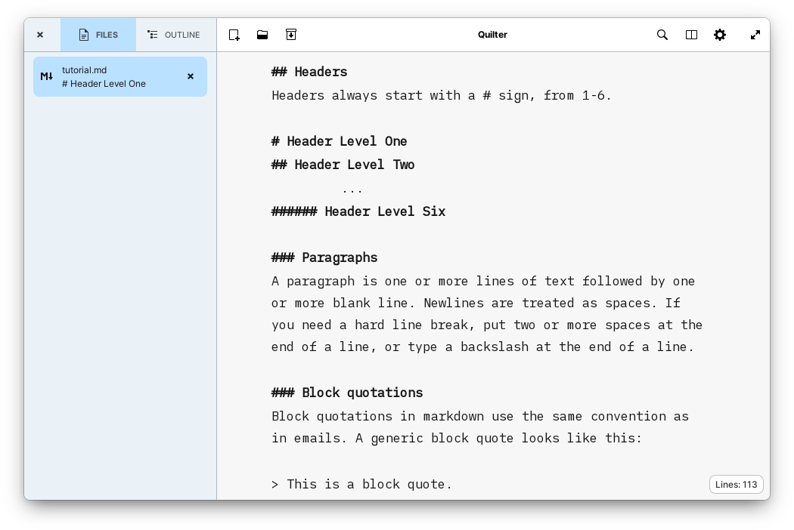

#  Quilter

## Focus on your writing

[](https://appcenter.elementary.io/com.github.lainsce.quilter)

[](https://travis-ci.org/lainsce/quilter)
[](http://www.gnu.org/licenses/gpl-3.0)



## License

Fonts under the `/data/font` directory are under [License: SIL OFL 1.1](http://scripts.sil.org/OFL), also copied there in full.

## Donations

Would you like to support the development of this app to new heights? Then:

[Be my backer on Patreon](https://www.patreon.com/lainsce)

or

[Buy me a coffee on Kofi](https://ko-fi.com/C1C169U6)

## Dependencies

Please make sure you have these dependencies first before building.

```bash
valac
libgranite-dev
libgtkspell3-3-dev
gtk+-3.0
gtksourceview-3.0
libwebkit2gtk-4.0-dev
libmarkdown2-dev
meson
```

## Building

Simply clone this repo, then:

```
$ meson build && cd build
$ meson configure -Dprefix=/usr
$ sudo ninja install
```
